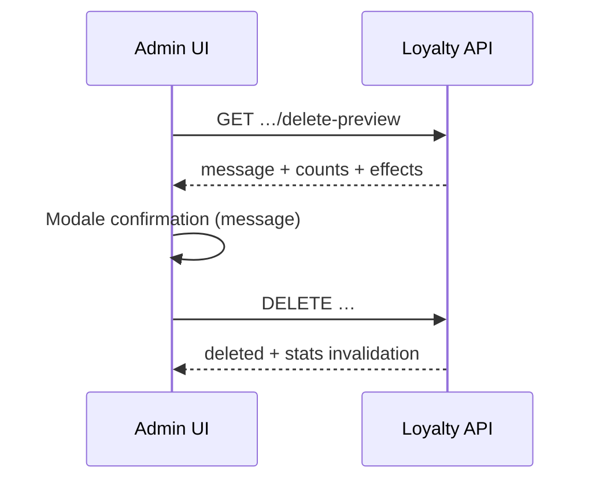

# Politique suppression catalogue — invalidation client

Document de référence pour le **backend** et le **frontend admin** (Amplify).

## Principes

| Action | Catalogue | Portefeuille client déjà émis |
|--------|-----------|-------------------------------|
| `PATCH active: false` | Stop nouvelles émissions | **Reste valide** jusqu'à usage / expiration |
| `DELETE` | Retrait définitif du catalogue | **ISSUED → INVALIDATED** ; USED/EXPIRED → historique lecture seule |

- L'historique n'est **jamais supprimé** (snapshots JSON conservés).
- Invalidation **granulaire** : supprimer une reward ou un produit n'affecte que cette entité.

## Statuts client

### Coupons (`customer_coupons`)

| Statut | Label UI | Actions admin |
|--------|----------|---------------|
| `ISSUED` | Actif | Utiliser, Expirer |
| `USED` | Utilisé | Rouvrir, Expirer |
| `EXPIRED` | Expiré | Aucune |
| `INVALIDATED` | Invalidé | Aucune |

Champs API utiles : `status_label`, `catalog_removed`, `admin_actions_enabled`, `allowed_admin_transitions`.

### Rewards (`customer_rewards`)

Mêmes statuts (+ `CANCELLED` legacy affiché comme Invalidé).

Champ `products` : liste depuis `payload.productSnapshots` avec `catalog_removed` par produit.

## Flux suppression (obligatoire côté front)



### Preview endpoints

| Ressource | Preview | DELETE |
|-----------|---------|--------|
| Type de coupon | `GET /admin/coupon-types/{id}/delete-preview` | `DELETE /admin/coupon-types/{id}` |
| Reward | `GET /rewards/{id}/delete-preview` | `DELETE /rewards/{id}` |
| Produit | `GET /admin/products/{id}/delete-preview` | `DELETE /admin/products/{id}` |

### Réponse preview (`CatalogDeletePreviewOut`)

```json
{
  "resource_type": "coupon_type",
  "resource_id": "uuid",
  "resource_name": "Coupon anniversaire",
  "can_delete": true,
  "recommended_action": null,
  "counts": {
    "customer_coupons_total": 12,
    "customer_coupons_issued": 3,
    "customer_rewards_issued_to_invalidate": 5
  },
  "effects": [
    "stop_new_issuance",
    "invalidate_active_customer_coupons",
    "preserve_snapshots_and_history"
  ],
  "message": "Texte français prêt pour la modale…"
}
```

**Afficher `message` tel quel** dans la modale de confirmation.

## Comportement par ressource

### Type de coupon supprimé

- Tous les coupons `ISSUED` → `INVALIDATED`
- Toutes les rewards liées `ISSUED` → `INVALIDATED`
- Coupons `USED` / `EXPIRED` : statut inchangé, `catalog_removed: true`, actions grisées
- `coupon_type_id` devient `null` (FK SET NULL) ; libellé via `couponTypeSnapshot`

### Reward supprimée (granulaire)

- Seules les `customer_rewards` **ISSUED** de **cette** reward → `INVALIDATED`
- Les autres rewards du même coupon **non affectées**
- Si plus aucune reward `ISSUED` sur le coupon → coupon auto-`INVALIDATED`
- USED/EXPIRED : `catalog_removed: true`, lecture seule

### Produit supprimé (granulaire)

- Liens `reward_products` retirés
- Dans chaque `productSnapshots` client : seul ce produit passe `catalog_removed: true`
- **Aucun** changement de statut coupon/reward

## Fiche client — endpoints

| Usage | Endpoint |
|-------|----------|
| Coupons + rewards | `GET /customers/{brand}/{profile_id}/coupons-with-rewards` |
| Historique unifié | `GET /customers/{brand}/{profile_id}/entitlements/history` |
| Action admin coupon | `PATCH /customers/{brand}/{profile_id}/coupons/{id}/status` |

Vérifier **`admin_actions_enabled`** avant d'afficher les boutons.

Corps PATCH inchangé : `{ "status": "USED" | "ISSUED" | "EXPIRED" }`.

Erreur 409 si action interdite (coupon invalidé / catalogue retiré).

## Historique

### Par client

`GET /customers/{brand}/{profile_id}/entitlements/history?limit=100&offset=0`

Agrège : émissions coupon/reward + actions admin + suppressions catalogue (`CATALOG_*`).

### Global (ops)

`GET /admin/entitlements/history?profile_id=optional&limit=100&offset=0`

## UI catalogue machine-readable

`GET /admin/customer-entitlements/ui-catalog` — règles d'affichage et endpoints.

## Modifications catalogue (PATCH)

- **Pas de rétroactivité** : les snapshots à l'émission restent figés.
- Changer nom/description/produits liés n'impacte pas les droits déjà émis.

## Migration base

```bash
alembic upgrade head
```

Révision `b9c0d1e2f3a4` : `customer_coupons.coupon_type_id` nullable + `ON DELETE SET NULL`.

## Checklist frontend

- [ ] Modale suppression : appeler `delete-preview`, afficher `message`, confirmer puis `DELETE`
- [ ] Liste catalogue : ne plus bloquer sur `can_delete=false` seul — toujours proposer suppression avec preview
- [ ] Fiche client : `display_label` / `status_label`, jamais les UUID
- [ ] Griser actions si `admin_actions_enabled === false`
- [ ] Badge « Modèle retiré du catalogue » si `catalog_removed`
- [ ] Rewards : afficher `products[]` avec état par produit
- [ ] Onglet historique : `entitlements/history` (remplace la lecture dispersée)
- [ ] Distinguer **Désactiver** (`active: false`) vs **Supprimer** dans les libellés UI
