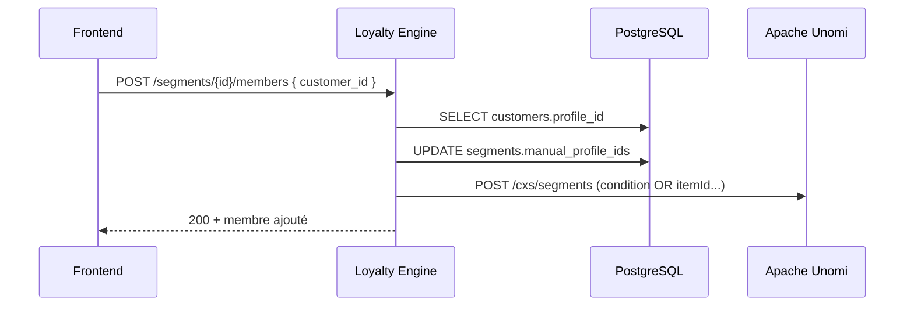
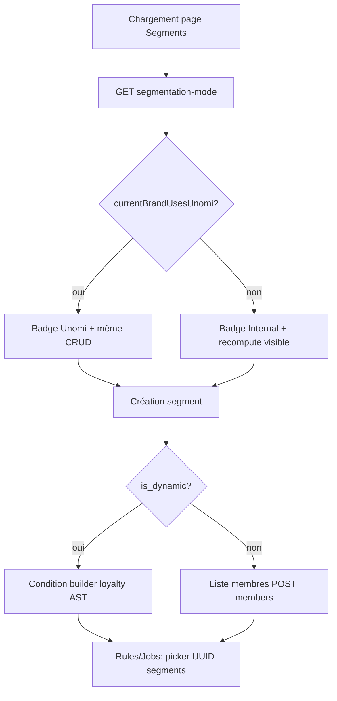

# Segments — guide d'intégration frontend

Toutes les routes admin segments exigent :

- Header **`X-Brand`** : marque courante du compte utilisateur (change à chaque switch de marque).
- **`Authorization`** : Basic auth API (`API_BASIC_AUTH_*` dans `.env`).

Découvrir le mode pour la marque active :

```http
GET /admin/segments/segmentation-mode
X-Brand: batira
```

Réponse clé : `segmentationMode` (`INTERNAL` | `UNOMI`), `currentBrandUsesUnomi`, `unomiPolicy`, `activeBrand`.

### Garantie brand context (important)

- La marque utilisée est **toujours** la marque courante du header `X-Brand` (ou `?brand=`), pas une marque codée en dur.
- En mode Unomi, le backend résout le `scope` Unomi depuis cette marque (`unomiScope` dans `segmentation-mode`).
- Changer de marque côté UI => toutes les lectures/écritures segments changent de contexte automatiquement.

Catalogue UI machine-readable :

```http
GET /admin/segments/ui-catalog
```

---

## Concepts

| Concept | Description |
|--------|-------------|
| **Registre moteur** | Ligne `segments` en PostgreSQL avec `id` (UUID) — **c'est ce UUID** que les règles et jobs référencent. |
| **provider** | `INTERNAL` (table `segment_members`) ou `UNOMI` (CDP Apache Unomi). |
| **unomi_segment_id** | Identifiant du segment dans Unomi (`metadata.id`), ex. `loyalty-batira-vip`. |
| **Segment statique** | `is_dynamic: false` — membres gérés manuellement. |
| **Segment dynamique** | `is_dynamic: true` — membres calculés par des **conditions**. |
| **conditions_format** | `loyalty_ast` (builder UI) ou `unomi_only` (segment CDP non traduisible — voir `unomi_condition`). |

### Segments importés depuis le CDP (liste `GET /admin/segments`)

Liste **paginée** ; en mode Unomi, **synchro CDP par défaut** sur la première page (`offset=0`) :

```http
GET /admin/segments?limit=20&offset=0
X-Brand: batira
```

Réponse :

```json
{
  "items": [ /* SegmentOut[], longueur <= limit */ ],
  "total": 66,
  "limit": 20,
  "offset": 0,
  "filters": { "q": null, "is_dynamic": null, "provider": null, "active": null },
  "sort": { "sort_by": "created_at", "sort_order": "desc" }
}
```

**Contrat pagination**

- `total` = nombre de segments **après filtres**, sur tout le catalogue (sans `limit`).
- `items` = **une seule page** : au plus `limit` lignes (`offset` … `offset + limit - 1` dans le tri global).
- Filtres + tri en base **avant** `COUNT` et **avant** `LIMIT` / `OFFSET`.

| Paramètre | Description |
|-----------|-------------|
| `limit` | Taille de page (défaut `20`, max `500`) |
| `offset` | Décalage (défaut `0`) |
| `sync_unomi` | Synchro CDP si `offset=0` (défaut `true`) ; pages suivantes : `X-Unomi-Sync: skipped-pagination` |
| `active` | `true` \| `false` |
| `q` | Recherche nom / description |
| `is_dynamic` | `true` \| `false` |
| `segment_type` | Alias `dynamic` \| `static` |
| `provider` | `INTERNAL` \| `UNOMI` |
| `sort_by` | `name`, `created_at`, `updated_at`, `last_computed_at`, `provider`, `is_dynamic`, `active`, `member_count` |
| `sort_order` | `asc` \| `desc` |

Répéter **filtres + tri** sur chaque page (`offset=20`, `40`, …).

Exemples :

```http
GET /admin/segments?limit=10&offset=0
GET /admin/segments?limit=10&offset=10
GET /admin/segments?limit=10&offset=0&q=vip&sort_by=name&sort_order=asc
```

Chargement rapide sans CDP :

```http
GET /admin/segments?sync_unomi=false
```

Après sync : `X-Unomi-Sync: ok`. CDP injoignable : **200** + liste locale + `X-Unomi-Sync: failed` + `X-Unomi-Sync-Detail`.

Chaque ligne `SegmentOut` expose :

| Champ | Segment créé dans le moteur | Segment créé dans le CDP |
|-------|----------------------------|---------------------------|
| `conditions` | AST loyalty (`customer.*`) | Rempli si traduction inverse réussie, sinon `null` |
| `unomi_condition` | JSON poussé au CDP | JSON tel que dans Unomi |
| `conditions_format` | `loyalty_ast` | `loyalty_ast` ou `unomi_only` |
| `id` | UUID moteur (rules/jobs) | UUID attribué à l’import |

L’UI du builder doit utiliser **`conditions`** quand `conditions_format === "loyalty_ast"`. Si `unomi_only`, afficher un message ou un éditeur JSON sur `unomi_condition` (types Unomi non supportés par le traducteur).

---

## INTERNAL (sans Unomi pour la marque)

### Créer un segment dynamique

```http
POST /admin/segments?recompute=true
Content-Type: application/json

{
  "name": "Clients actifs 90j",
  "description": "...",
  "is_dynamic": true,
  "active": true,
  "conditions": {
    "and": [
      {
        "field": "customer.metrics.transactions_count_90d",
        "operator": "gte",
        "value": 1
      }
    ]
  }
}
```

- `conditions` : AST loyalty (même format que les règles), champs via `GET /admin/segments/ui-options/condition-fields`.
- `recompute=true` (défaut) : remplit `segment_members` avec `source=DYNAMIC`.

### Créer un segment statique

```http
POST /admin/segments

{
  "name": "Liste VIP manuelle",
  "is_dynamic": false,
  "active": true
}
```

Pas de `conditions`. Ajouter des membres ensuite.

### Éditer un segment dynamique

```http
PATCH /admin/segments/{segment_id}?recompute=true

{
  "name": "Nouveau nom",
  "conditions": { ... },
  "active": true
}
```

Recalcul auto si `conditions` ou réactivation change.

### Éditer un segment statique

```http
PATCH /admin/segments/{segment_id}

{
  "name": "...",
  "description": "...",
  "active": false
}
```

Pas de modification de `conditions`. Membres via routes `/members`.

### Membres (statique)

| Action | Méthode |
|--------|---------|
| Liste | `GET /admin/segments/{id}/members?limit=500&offset=0` |
| Ajouter | `POST /admin/segments/{id}/members` body `{ "customer_id": "uuid" }` |
| Bulk add | `POST /admin/segments/{id}/members/bulk` body `{ "customer_ids": [...] }` |
| Retirer | `DELETE /admin/segments/{id}/members/{customer_id}` |
| Bulk remove | `POST /admin/segments/{id}/members/bulk-delete` |

Réponse liste (`SegmentMembersListResponse`) : `total`, `items[]` avec `customer_id`, `profile_id`, `source` (`STATIC` / `DYNAMIC`).

### Membres (dynamique)

- **Lecture** : `GET …/members` après recompute (membres `DYNAMIC`).
- **Pas d'ajout manuel** : `POST …/members` → **400**.
- **Recalcul** : `POST /admin/segments/{id}/recompute` ou `POST /admin/segments/recompute`.

### Consulter / auditer les membres (tous modes)

**Une seule route** pour statique, dynamique, INTERNAL et UNOMI :

```http
GET /admin/segments/{segment_id}/members?limit=100&offset=0
X-Brand: <marque>
```

| Type | Source des membres |
|------|-------------------|
| Dynamique (INTERNAL ou UNOMI) | Table `segment_members` (`source=DYNAMIC`) après recalcul |
| Statique INTERNAL | `segment_members` (`source=STATIC`) |
| Statique UNOMI | `manual_profile_ids` (+ résolution `customer_id`) |

**Paramètres optionnels (segments dynamiques avec `conditions`)** :

| Query | Effet |
|-------|--------|
| `refresh=true` | Recalcule la liste (`POST …/recompute` équivalent) **puis** renvoie les membres à jour |
| `verify=true` | Pour chaque ligne de la **page**, réévalue l’AST sur le client **maintenant** → `matches_conditions` |

Exemple écran d’audit :

```http
GET /admin/segments/{id}/members?limit=500&offset=0&refresh=true&verify=true
```

Champs utiles dans la réponse :

- `total`, `items[]` (`customer_id`, `profile_id`, `source`, `computed_at`)
- `last_computed_at`, `membership_stale` (= `needsRecompute` sur le segment)
- `refreshed` : un recalcul vient d’être fait
- `verified` : vérification live activée
- `page_mismatch_count` : nombre de membres sur la page qui **ne matchent plus** les conditions (données client changées depuis le dernier recalcul)
- `items[].matches_conditions` : `true` / `false` / `null` (si pas de `customer_id` en base)

**Workflow UI recommandé** : bouton « Voir les membres » → `GET …/members` ; si `membership_stale` ou liste vide → proposer « Actualiser » (`refresh=true`) ; option « Vérifier les conditions » (`verify=true`).

---

## UNOMI (CDP configuré dans `.env`)

Même routes ; comportement différent. `SegmentOut.provider === "UNOMI"`.

### Créer un segment dynamique

```http
POST /admin/segments

{
  "name": "Gold tier prospects",
  "is_dynamic": true,
  "active": true,
  "conditions": {
    "and": [
      { "field": "customer.loyalty_status", "operator": "eq", "value": "gold" }
    ]
  }
}
```

- Le moteur **traduit** l'AST loyalty → condition Unomi et crée le segment dans le CDP.
- `conditions` reste stocké côté moteur (affichage UI + **recalcul membership**).
- `unomi_condition` dans la réponse = JSON Unomi poussé au CDP.
- **Recalcul membership** : comme INTERNAL (`segment_members`, `source=DYNAMIC`) — `POST …/recompute` ou job `MAINT_RECOMPUTE_SEGMENTS`. Le CDP ne fait pas foi pour le décompte affiché.

Alternative : envoyer directement du JSON Unomi :

```json
{
  "is_dynamic": true,
  "unomi_condition": {
    "type": "profilePropertyCondition",
    "parameterValues": { ... }
  }
}
```

### Créer un segment statique (liste manuelle)

```http
POST /admin/segments

{
  "name": "Campagne one-shot",
  "is_dynamic": false,
  "active": true
}
```

Segment Unomi avec condition vide / placeholder jusqu'au premier membre.

### Éditer dynamique Unomi

```http
PATCH /admin/segments/{segment_id}

{
  "conditions": { ... }
}
```

ou `"unomi_condition": { ... }` pour contourner la traduction AST.

Pousse la mise à jour vers Unomi (`POST /cxs/segments`).

### Éditer statique Unomi

```http
PATCH /admin/segments/{segment_id}

{ "name": "...", "description": "...", "active": true }
```

Les membres ne se gèrent **pas** via PATCH ; utiliser `/members`.

### Membres statique Unomi

Voir la section détaillée **[Unomi — segment statique : membres et suppression](#unomi--segment-statique--membres-et-suppression)** (flux complets, réponses API, suppression CDP + moteur).

En résumé : mêmes routes `/members` que INTERNAL, mais stockage dans `manual_profile_ids` + sync condition Unomi (pas `segment_members`).

### Membres dynamique Unomi

```http
GET /admin/segments/{segment_id}/members?limit=100&offset=0
```

- Lit `segment_members` (`source=DYNAMIC`) après recalcul moteur — **pas** l'API Unomi impacted.
- `items[].customer_id` et `profile_id` depuis la table `customers`.
- Recalcul : `POST /admin/segments/{id}/recompute?` ou `POST /admin/segments/recompute` (création avec `?recompute=true` par défaut).

Pas d'ajout/suppression manuelle (400).

---

## Unomi — segment statique : membres et suppression

Cette section décrit le comportement **réel** du moteur pour `provider = UNOMI` et `is_dynamic = false`. L’API HTTP est la même qu’en INTERNAL ; seule l’implémentation change.

### Pourquoi pas une table `segment_members` ?

Unomi ne propose pas d’« épingler » un profil dans un segment par une simple ligne SQL. Un segment est une **définition avec une condition** ; les profils qui matchent entrent dans le segment.

Pour une liste manuelle, le moteur :

1. garde la liste des **`profileId` Unomi** dans `segments.manual_profile_ids` (JSON PostgreSQL) ;
2. traduit cette liste en condition Unomi du type :

```text
OR(
  itemId = "profile-abc",
  itemId = "profile-def",
  ...
)
```

3. envoie la **définition complète** du segment au CDP : `POST http://<UNOMI_BASE_URL>/cxs/segments`.

Chaque ajout ou retrait **réécrit** toute la condition (pas un PATCH profil par profil côté Unomi).



### Identifiants côté front

| ID | Rôle |
|----|------|
| **`customer_id`** (UUID) | Ce que l’UI envoie (sélection dans la liste clients loyalty). |
| **`profile_id`** (string) | Identifiant Unomi (`Customer.profile_id`) — utilisé dans la condition CDP. |
| **`segments.id`** (UUID) | Registre moteur — pour rules / jobs / routes `/members`. |
| **`unomi_segment_id`** (string) | ID segment dans Unomi — debug / admin CDP uniquement. |

Le front **ne doit pas** appeler Unomi directement pour gérer les membres : tout passe par le loyalty engine.

---

### Ajouter des membres

**Prérequis** : segment `is_dynamic: false`, `provider: UNOMI`, client existant pour la marque (`customers` avec `profile_id` renseigné).

#### Un membre

```http
POST /admin/segments/{segment_id}/members
X-Brand: batira
Content-Type: application/json

{ "customer_id": "550e8400-e29b-41d4-a716-446655440000" }
```

**Succès (200)** — corps type `SegmentMemberOut` :

```json
{
  "segment_id": "...",
  "customer_id": "...",
  "source": "UNOMI",
  "computed_at": null,
  "created_at": null
}
```

**Erreurs** :

| Code | Cause |
|------|--------|
| 400 | Segment dynamique, ou client inconnu / autre marque |
| 409 | Client déjà dans le segment (`created: 0`) |
| 502 | Échec sync Unomi après MAJ locale (rollback) |

#### Plusieurs membres (recommandé UI multi-select)

```http
POST /admin/segments/{segment_id}/members/bulk
Content-Type: application/json

{ "customer_ids": ["uuid-1", "uuid-2", "uuid-3"] }
```

**Réponse** `SegmentMembersBulkResult` :

```json
{
  "created": 2,
  "skipped_existing": 1,
  "deleted": 0,
  "missing": 0,
  "invalid": 0,
  "errors": []
}
```

- **`missing`** : `customer_id` introuvable ou sans `profile_id` pour cette marque.
- **`skipped_existing`** : `profile_id` déjà dans `manual_profile_ids`.
- **`created`** : nouveaux profils ajoutés puis sync Unomi effectuée **une fois** à la fin du lot.

---

### Retirer des membres

#### Un membre

```http
DELETE /admin/segments/{segment_id}/members/{customer_id}
X-Brand: batira
```

**Succès** : `{ "deleted": true }`

**Erreurs** : 404 si le client n’était pas dans la liste ; 400 si segment dynamique ; 502 si Unomi échoue.

#### Bulk

```http
POST /admin/segments/{segment_id}/members/bulk-delete
Content-Type: application/json

{ "customer_ids": ["uuid-1", "uuid-2"] }
```

Réponse : `deleted`, `missing` (idem bulk add).

Après retrait, la condition Unomi est recalculée sans ces `itemId`. Si la liste devient vide, le moteur pousse une condition placeholder (`itemId = __no_profiles__`) pour garder un segment valide côté CDP.

---

### Lister les membres

```http
GET /admin/segments/{segment_id}/members?limit=100&offset=0
X-Brand: batira
```

**Réponse** `SegmentMembersListResponse` :

```json
{
  "segment_id": "...",
  "provider": "UNOMI",
  "is_dynamic": false,
  "unomi_segment_id": "loyalty-batira-campagne",
  "total": 42,
  "limit": 100,
  "offset": 0,
  "items": [
    {
      "segment_id": "...",
      "customer_id": "uuid-or-null",
      "profile_id": "unomi-profile-id",
      "source": "UNOMI",
      "membership_origin": "manual_profile_ids",
      "customer_found_in_engine": true
    }
  ],
  "note": "Static: manual_profile_ids synced as OR(itemId) condition in Unomi."
}
```

**UI** :

- Afficher `profile_id` (toujours présent).
- Si `customer_found_in_engine: false` → badge « Profil CDP sans fiche loyalty » (le profil est quand même dans le segment).
- Pagination via `total`, `limit`, `offset`.

---

### Resynchroniser manuellement (Unomi)

Si le CDP a été modifié à la main ou après une erreur partielle :

```http
POST /admin/segments/{segment_id}/sync-unomi
X-Brand: batira
```

**Réponse** :

```json
{
  "unomiSegmentId": "loyalty-batira-campagne",
  "profileCount": 42,
  "synced": true
}
```

Repousse `manual_profile_ids` → condition OR → `POST /cxs/segments`. N’ajoute ni ne retire de membres.

---

### Supprimer un segment (Unomi + loyalty engine)

La suppression est **atomique côté API** : si Unomi échoue (hors 404), la ligne loyalty **n’est pas** supprimée.

```mermaid
flowchart TD
  A[DELETE /admin/segments/{id}] --> B{can_delete?}
  B -->|non| C[409 + règles/jobs référencés]
  B -->|oui| D[DELETE Unomi /cxs/segments/{unomi_segment_id}]
  D --> E{Unomi OK ou 404?}
  E -->|non| F[502 - rien supprimé en DB]
  E -->|oui| G[DELETE row segments en PostgreSQL]
  G --> H[200 deleted: true]
```

#### Étape 1 — Vérifier `can_delete`

Sur `GET /admin/segments` ou `GET /admin/segments/{id}` :

```json
{
  "can_delete": false,
  "referencing_rules_count": 2,
  "referencing_internal_jobs_count": 1,
  "recommended_action": "detach_references"
}
```

Tant qu’une **règle** a ce segment dans `segment_ids` ou un **job** a ce `segment_id` → **409** au DELETE.

**Action UI** : liens vers les règles/jobs concernés ; retirer le segment de ces configs ; réessayer.

#### Étape 2 — Appel DELETE

```http
DELETE /admin/segments/{segment_id}
X-Brand: batira
```

| Résultat | Effet |
|----------|--------|
| **200** `{ "deleted": true }` | Segment supprimé dans **Unomi** (si `provider=UNOMI`) **et** dans le **registre** PostgreSQL. |
| **409** | Encore référencé par règle/job. |
| **404** | Segment inconnu ou autre marque. |
| **502** | Unomi a refusé la suppression → segment **toujours présent** en base loyalty. |

#### Ce qui est supprimé / conservé

| Système | Supprimé ? |
|---------|------------|
| Ligne `segments` (UUID) | Oui |
| `manual_profile_ids` | Oui (avec la ligne) |
| Segment dans Unomi (`unomi_segment_id`) | Oui (`DELETE /cxs/segments/...`) |
| Lignes `segment_members` | CASCADE si existaient (cas rare Unomi statique) |
| Règles / jobs | **Non** — il faut les détacher avant ; sinon 409 |

Les règles et jobs ne sont **jamais** supprimés automatiquement.

---

### Comparaison INTERNAL vs Unomi (statique uniquement)

| Action | INTERNAL | UNOMI statique |
|--------|----------|----------------|
| Stockage liste | `segment_members` (`source=STATIC`) | `segments.manual_profile_ids` |
| Ajouter | `INSERT segment_members` | `profile_id` → JSON + sync condition Unomi |
| Retirer | `DELETE segment_members` | Retrait du JSON + sync Unomi |
| Liste membres | SQL join `customers` | `manual_profile_ids` + lien `customers` |
| Supprimer segment | DELETE row + CASCADE members | DELETE Unomi + DELETE row registre |
| Cible rules/jobs | `segments.id` (UUID) | `segments.id` (UUID) — **identique** |

---

### Checklist écran « Membres » (front)

1. Masquer boutons ajout/retrait si `is_dynamic === true`.
2. Sélecteur clients → envoyer `customer_id`, pas `profile_id`.
3. Après bulk add/remove → rafraîchir `GET …/members` et `GET …/segments/{id}` (`member_count`, `manual_profile_ids`).
4. Bouton admin optionnel « Resynchroniser Unomi » → `POST …/sync-unomi` (si erreur 502 précédente).
5. Écran suppression segment : bloquer si `!can_delete`, afficher compteurs `referencing_*`.

---

## Liste / détail segment

```http
GET /admin/segments
GET /admin/segments/{segment_id}
```

En mode `UNOMI`, `GET /admin/segments` est aligné sur la CDP :

- lecture des segments Unomi,
- filtre par `metadata.scope == X-Brand` (scope effectif),
- synchronisation du registre local (UUID moteur conservé pour rules/jobs),
- retour JSON `SegmentOut` inchangé pour l'UI (même structure qu'avant).

👉 Donc l'UI récupère bien tous les segments de la marque courante (scope courant), sans changer le contrat de réponse.

`SegmentOut` champs utiles UI :

| Champ | Usage |
|-------|--------|
| `provider` | Badge INTERNAL / UNOMI |
| `is_dynamic` | Mode statique vs dynamique |
| `member_count` | Compteur (Unomi : impacted ou manual list) |
| `needs_recompute` | INTERNAL dynamique seulement |
| `can_delete` | false si règles/jobs référencent le segment |
| `referencing_rules_count` | |
| `referencing_internal_jobs_count` | |
| `unomi_segment_id` | Lien debug CDP |
| `manual_profile_ids` | Liste statique Unomi |

Sélecteurs :

```http
GET /admin/ui-options/segments?active=true
```

Retourne `id`, `name`, `is_dynamic` — utiliser **`id` (UUID)** dans les formulaires règles/jobs.

---

## Règles (`Rule.segment_ids`)

```http
POST /admin/rules
PATCH /admin/rules/{id}
```

```json
{
  "segment_ids": ["uuid-segment-1", "uuid-segment-2"],
  "conditions": { ... },
  "actions": [ ... ]
}
```

**Sémantique** (dans `process_transaction_rules`) :

1. Si `segment_ids` vide/null → pas de filtre segment.
2. Sinon le client doit être membre d'**au moins un** segment (OR).
3. Puis évaluation des `conditions` transaction.

**Membership** :

- INTERNAL : table `segment_members`.
- UNOMI : API match Unomi + `manual_profile_ids` pour statiques.

Toujours stocker le **UUID moteur**, jamais `unomi_segment_id`.

---

## Jobs internes (`InternalJob.segment_id`)

```http
POST /admin/internal-jobs
PATCH /admin/internal-jobs/{id}
```

```json
{
  "segment_id": "uuid-segment",
  "selector": { "and": [ ... ] },
  "job_key": "..."
}
```

**Sémantique** (sélection clients avant le selector) :

- `segment_id` null → tous les clients de la marque (puis `selector`).
- Sinon restriction aux membres du segment, puis `selector` AST.

- INTERNAL : `JOIN segment_members`.
- UNOMI : `Customer.profile_id IN (...)` depuis Unomi impacted / liste manuelle.

---

## Erreurs courantes (UI)

| Code | Cas |
|------|-----|
| 400 | Membre manuel sur segment dynamique |
| 400 | `recompute` sur marque / segment Unomi |
| 400 | `conditions` sur segment statique |
| 409 | DELETE segment référencé par règle/job |
| 409 | Membre déjà présent (statique) |
| 502 | Unomi CDP injoignable, condition refusée par le CDP, ou échec sync membres |

### Dépannage 502 « Unable to sync » (création / membres)

1. **Vérifier la connectivité** : `GET /admin/segments/segmentation-mode` avec `X-Brand` → `unomiConfigured: true`, `currentBrandUsesUnomi: true`.
2. **Lire le `detail` API** (pas seulement le message UI) : souvent `Unomi HTTP 500` + `internalServerError` = condition mal formée pour le CDP.
3. **Segment dynamique** : le moteur traduit automatiquement les types pour Unomi :
   - numériques (`status_points`, `metrics.*`) → `propertyValueInteger`
   - `customer.birthdate` — granularités API :
     - **full** : `YYYY-MM-DD` → Unomi `properties.birthDate` (epoch ms)
     - **day_month** : `MM-DD` → Unomi `properties.birthDate` (string) ; `{"$system":"today"}` → MM-DD du jour (anniversaire roulant)
     - **month** : `MM` ou `--MM` → Unomi `properties.birthMonth` (integer)
     - **year** : `YYYY` → Unomi `properties.birthYear` (integer)
     - Format `DD/MM/YYYY` refusé. Catalogues : `fieldMeta.granularities` + `valuePresets.birthdate`.
   - dates/heures (`created_at`, `last_activity_at`, `metrics.last_transaction_at`) → `propertyValueDate` sur `loyaltyCreatedAt`, `lastActivityAt`, etc.
   Redémarrer l’API après mise à jour du moteur.
4. **Segment statique sans membres** : création OK ; ajout de membres déclenche la sync → utiliser `POST …/sync-unomi` si besoin.
5. **Segment manuel** : les clients doivent avoir un `profile_id` Unomi (sync profils activée).

---

## Flux UI recommandé



---

## Champs conditions (builder)

```http
GET /admin/segments/ui-options/condition-fields
X-Brand: ...
```

Champs `customer.*` et `customer.metrics.*` uniquement (pas `payload.*`).

---

## Smoke test automatisé (Unomi)

Script fourni : `scripts/smoke_unomi_segments.py`

Il valide en chaîne (brand courante) :

1. `segmentation-mode` en `UNOMI`
2. création segment statique
3. création segment dynamique
4. liste + détail segments via backend
5. add/list/remove membre statique
6. `sync-unomi`
7. update dynamique (`unomi_condition`)
8. vérification directe dans Unomi (`scope == X-Brand`)
9. suppression + vérification suppression CDP

Exécution :

```bash
python scripts/smoke_unomi_segments.py --x-brand batira
```

Options utiles :

- `--backend-base-url` (défaut `http://127.0.0.1:8000`)
- `--api-username` / `--api-password`
- `--unomi-base-url` / `--unomi-username` / `--unomi-password`

Notes :

- Le script charge `.env` automatiquement.
- Le backend doit être démarré avant exécution.
