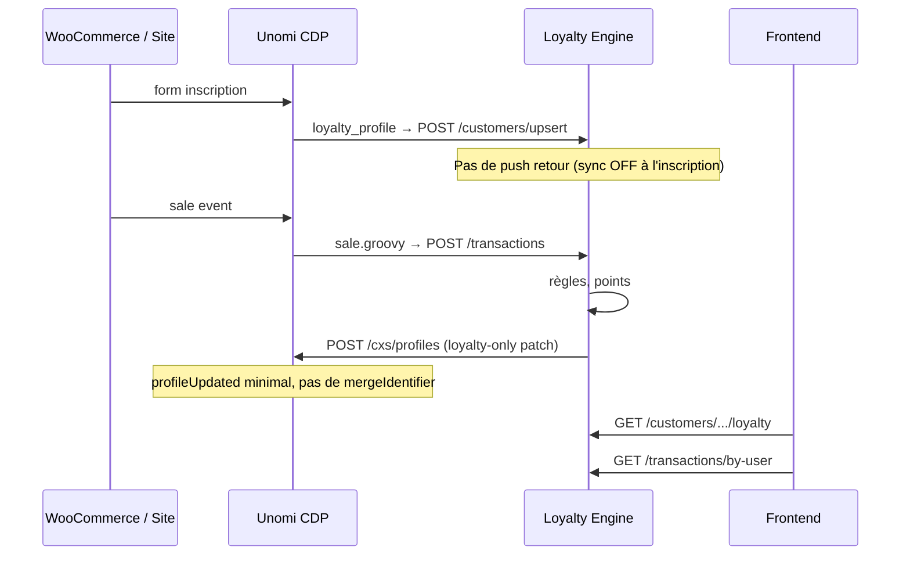

# Étude — synchronisation Loyalty → Unomi (refonte sûre)

Document de référence avant réactivation de `UNOMI_PROFILE_SYNC`.  
Contexte : la première implémentation a provoqué des tempêtes `profileUpdated`, des fusions involontaires et l’instabilité du CDP.

---

## 1. État actuel (post-rollback)

| Flux | Statut | Remarque |
|------|--------|----------|
| Unomi → Loyalty (`loyalty_profile.groovy` → `POST /customers/upsert`) | **Actif** | Inscription, identité client |
| Unomi → Loyalty (`sale.groovy` → `POST /transactions`) | **Actif** | Ventes, points |
| Loyalty → Unomi (push champs fidélité) | **Désactivé** | `UNOMI_PROFILE_SYNC=false` (défaut) |
| Segments Unomi | **Actif** | Indépendant du profile sync |

**Tests automatisés** : 87 passed (pytest complet).

---

## 2. Pourquoi la première implémentation a échoué

### 2.1 Boucle et tempête d’événements

```
Loyalty traite vente
  → POST /cxs/profiles (loyaltyStatus, statusPoints, …)
    → Unomi émet profileUpdated
      → mergeProfilesOnEmail, batira, segments, loyalty_profile, …
        → HTTP vers Loyalty / Mautic
          → ClosedChannelException, lenteur, blocages
```

Chaque push Loyalty → Unomi déclenchait **toutes** les règles `profileUpdatedEventCondition` existantes — conçues pour le CDP, pas pour la fidélité.

### 2.2 Champs interdits dans le payload

| Champ pushé par Loyalty | Effet indésirable |
|-------------------------|-------------------|
| `scopeEmail` | Alimente `mergeProfilesOnEmail` |
| `systemProperties.mergeIdentifier` | Fusion profils |
| `email`, `firstName`, … (mode full) | Réécrit l’identité CDP |
| `contactInfoSubmitted` via eventcollector | Déclenche règles marketing |

### 2.3 Push au mauvais moment

- Push **immédiat après inscription** Unomi → Loyalty (ping-pong)
- Push **pendant** `earn_points` + **après** transaction (3× par vente)
- Push avec `eventcollector` → nouveau UUID ou règles CDP

### 2.4 Décalage profileId (côté Unomi, pas Loyalty)

Le cookie session Unomi réutilise le profileId N−1 à l’inscription N. Corrigé dans `loyalty_profile.groovy` via résolution email/`ProfileService` (comme `sale.groovy`).

---

## 3. Principes de la refonte sûre

### Principe A — Un seul sens à la fois

- **Unomi → Loyalty** : temps réel (inscription, ventes) — déjà OK.
- **Loyalty → Unomi** : **optionnel**, **minimal**, **sans boucle**.

### Principe B — Le frontend lit Loyalty, pas Unomi

Pour points, statut, historique : `GET /customers/{brand}/{profileId}/loyalty`, `/transactions/by-user`, etc.  
Unomi n’a **pas besoin** des champs fidélité pour le parcours client — seulement si le CDP/marketing en a besoin (segments, personnalisation).

### Principe C — Push Unomi = patch loyalty-only

Uniquement via `POST /cxs/profiles` (jamais `eventcollector` pour la fidélité).

Champs autorisés (liste blanche) :

```
loyaltyStatus, statusPoints, loyaltyPointsBalance, loyaltyTierName,
loyaltyEngineCustomerId, loyaltyEngineSyncedAt, lastActivityAt,
loyaltyStatusAssignedAt, loyaltyStatusExpiresAt, pointsExpiresAt,
statusPointsResetAt, unomiProfileId
```

**Interdits** : `email`, `scopeEmail`, `mergeIdentifier`, `firstName`, `lastVisit`, `brand`, etc.

### Principe D — Un push max par événement métier

| Événement Loyalty | Push Unomi ? |
|-------------------|--------------|
| Inscription (`CUSTOMER_REGISTRATION`) | **Non** (reporté au 1er achat ou job) |
| Vente traitée (`PROCESSED`) | **Oui**, 1× en fin de traitement |
| Changement statut admin | **Oui**, 1× |
| `earn_points` intermédiaire | **Non** |
| Upsert Unomi entrant | **Non** (header `X-Profile-Sync-Source: unomi`) |

### Principe E — Skip si inchangé

Comparer `loyaltyStatus` + `statusPoints` + `loyaltyPointsBalance` sur le profil Unomi existant ; ne pas pousser si identique (`UNOMI_PROFILE_SYNC_SKIP_UNCHANGED=true`).

### Principe F — Garde côté Unomi (sans modifier vos règles CDP)

Dans `loyalty_profile.groovy` : la règle ne s’exécute que sur `form` + `enregistrementbat` — **ne pas** ajouter `profileUpdatedEventCondition` sur cette action.

Si un jour une règle loyalty écoute `profileUpdated`, filtrer les clés `loyaltyOnlyKeys` (déjà prévu dans le code legacy).

---

## 4. Architecture cible recommandée



### Mode opératoire recommandé (.env)

```env
# Phase 1 — stable (actuel)
UNOMI_PROFILE_SYNC=false

# Phase 2 — refonte (après validation)
UNOMI_PROFILE_SYNC=true
UNOMI_PROFILE_SYNC_TRANSPORT=profiles
UNOMI_PROFILE_SYNC_MODE=minimal
UNOMI_PROFILE_SYNC_SET_MERGE_IDENTIFIER=false
UNOMI_PROFILE_SYNC_SKIP_UNCHANGED=true
UNOMI_PROFILE_SYNC_SKIP_ON_REGISTRATION=true
UNOMI_PROFILE_SYNC_STRICT=false
```

---

## 5. Plan de réactivation par phases

### Phase 0 — Maintenant (rollback)

- [x] `UNOMI_PROFILE_SYNC=false`
- [x] Pas de push post-transaction / post-upsert
- [x] `loyalty_profile.groovy` stable (UTF-8, CF7, résolution profileId)
- [x] 87 tests pytest OK

### Phase 1 — Validation Unomi seul

1. Redéployer `loyalty_profile.groovy` sur Unomi
2. Inscription test (navigation privée, email neuf)
3. Vérifier : création contact Unomi + client Loyalty + **aucun** `unomi profile sync ok` dans les logs Loyalty
4. Vente test → points dans Loyalty via API

### Phase 2 — Push minimal post-vente uniquement

1. Activer `UNOMI_PROFILE_SYNC=true` + variables Phase 2
2. Réactiver **uniquement** le hook post-transaction `PROCESSED` (1 push)
3. Monitorer karaf.log : pas de rafale `mergeProfilesOnEmail`
4. Rollback immédiat si > 3 `profileUpdated` par vente

### Phase 3 — Frontend

1. Onglet fidélité : appels API Loyalty (pas profil Unomi)
2. Recherche client : `profileId` + fallback `?email=`
3. Polling après vente (2–5 s), pas lecture Unomi

### Phase 4 — Optionnel (segments CDP)

Si segments Unomi doivent cibler `loyaltyStatus` :
- Job nightly `MAINT_RECOMPUTE` + push batch par marque
- Ou push on-demand via admin « Sync vers Unomi »

---

## 6. Checklist avant chaque push Unomi (code)

- [ ] `unomi_profile_sync_enabled_for_brand()` == true
- [ ] `should_skip_unomi_profile_push()` == false (pas upsert entrant Unomi)
- [ ] `sync_mode == minimal`
- [ ] Payload sans `scopeEmail` / `mergeIdentifier`
- [ ] `transport == profiles` (pas eventcollector)
- [ ] `_loyalty_sync_delta_unchanged()` == false
- [ ] Raison != `unomi_upsert_deferred` si inscription récente

---

## 7. Fichiers concernés (refonte)

| Fichier | Rôle |
|---------|------|
| `app/services/unomi_profile_service.py` | Payload minimal, skip, garde |
| `app/services/transaction_service.py` | Hook post-vente (à réactiver en Phase 2) |
| `app/routes/customers.py` | Upsert sans push retour |
| `loyalty_profile.groovy` | Unomi → Loyalty uniquement |
| `docs/ROLLBACK_UNOMI_SYNC.md` | Procédure rollback |

---

## 8. Décision produit

**Recommandation** : garder `UNOMI_PROFILE_SYNC=false` en production jusqu’à Phase 2 validée en staging.  
Le parcours client complet (inscription, points, ventes) **ne dépend pas** du push Loyalty → Unomi.

La refonte propre = push **minimal**, **différé**, **profiles-only**, **une fois par vente**, avec frontend branché sur **Loyalty API**.
