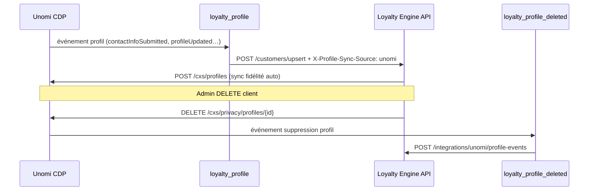

# Déploiement — sync profils Loyalty ↔ Unomi (CDP)

Guide opérationnel pour l’équipe CDP + ops loyalty. Deux actions Groovy + règles Unomi + configuration `.env` loyalty.

---

## Vue d’ensemble

| Sens | Mécanisme | Fichier |
|------|-----------|---------|
| **Unomi → Loyalty** (création / MAJ profil) | Règle Unomi → action `loyalty_profile` | `loyalty_profile.groovy` |
| **Loyalty → Unomi** (données fidélité) | Automatique côté API loyalty | rien à déployer sur CDP |
| **Loyalty → Unomi** (suppression) | `DELETE /customers/{brand}/{profile_id}` | rien sur CDP |
| **Unomi → Loyalty** (suppression) | Règle Unomi → action `loyalty_profile_deleted` | `scripts/unomi_loyalty_profile_deleted.groovy` |



---

## Multi-marques (même CDP, liste non exhaustive)

**`batira` dans ce guide = exemple uniquement.** Le loyalty engine et les groovies ne sont pas limités à une marque.

### Côté Loyalty Engine — aucune liste à maintenir

| Mécanisme | Comportement |
|-----------|--------------|
| `X-Brand` | Chaque requête admin / API utilise la marque courante (UI, compte, etc.) |
| `UNOMI_BASE_URL` + `UNOMI_PASSWORD` | **Une seule CDP** pour toutes les marques |
| Scope Unomi | Par défaut **scope = clé marque** (`batira`, `qilinsa`, `lesjardinsderene`, …) |
| `UNOMI_SCOPE_<MARQUE>` | Uniquement si le scope CDP ≠ la clé loyalty (ex. `UNOMI_SCOPE_LESJARDINSDERENE=jardins`) |

**Ne pas** remplir `UNOMI_BRANDS` sauf si vous voulez un **opt-in** explicite. Sans cette variable, **toute marque** avec credentials Unomi est éligible.

Opt-out ponctuel : `UNOMI_INTERNAL_BRANDS=marque_sans_cdp` ou `UNOMI_PROFILE_SYNC_DISABLED=…`.

### Côté CDP Unomi — 2 groovies **une fois**, règles **par scope**

| Élément | Combien ? | Pourquoi |
|---------|-----------|----------|
| Action `loyalty_profile` | **1×** (globale) | Le script lit `event.scope` → `brand` dynamiquement |
| Action `loyalty_profile_deleted` | **1×** (globale) | Idem |
| Règle upsert profil | **1 règle par scope / marque** | Dans Unomi, une règle est rattachée à un `metadata.scope` |
| Règle suppression profil | **1 règle par scope / marque** | Même raison |

**Nouvelle marque sur le CDP** (sans changer le loyalty engine) :

1. Le scope existe déjà dans Unomi (ex. `nouvellemarque`).
2. Dupliquer les 2 règles (upsert + delete) en changeant seulement `metadata.scope` et l’`id` / `name` de la règle.
3. Paramètres action **identiques** (`loyaltyUrl`, auth, `webhookSecret`) — pas de liste de marques dans le groovy.
4. Vérifier : `GET /admin/segments/segmentation-mode` + `X-Brand: nouvellemarque` → `profileSyncEnabled: true`.

### Alignement scope CDP ↔ clé loyalty

Le groovy résout la marque dans cet ordre :

1. `event.properties.brand`
2. `event.scope` (souvent = scope de la règle)
3. `profile.properties.brand`

**Convention recommandée** : scope Unomi = clé `X-Brand` loyalty (minuscules cohérentes). Si ce n’est pas le cas pour une marque, ajouter `UNOMI_SCOPE_<MARQUE>` dans `.env` loyalty **et** s’assurer que le profil Unomi est bien dans ce scope.

### Schéma multi-marques

```
                    ┌─────────────────────────────────┐
                    │  CDP Unomi (une URL, un login)  │
                    │  scope: batira | qilinsa | …    │
                    └───────────────┬─────────────────┘
                                    │
          ┌─────────────────────────┼─────────────────────────┐
          │                         │                         │
   règle scope=batira        règle scope=qilinsa       règle scope=…
          │                         │                         │
          └─────────────────────────┼─────────────────────────┘
                                    ▼
                    ┌─────────────────────────────────┐
                    │  Groovy loyalty_profile (×1)    │
                    │  brand = event.scope            │
                    └───────────────┬─────────────────┘
                                    ▼
                    ┌─────────────────────────────────┐
                    │  Loyalty Engine (PostgreSQL)    │
                    │  customers.brand = X-Brand      │
                    └─────────────────────────────────┘
```

---

## Prérequis

### Côté Loyalty Engine (déjà dans le repo)

1. Code déployé avec sync profils (`unomi_profile_service`, routes `customers`, `integrations/unomi`).
2. `.env` production (exemple) :

```env
UNOMI_BASE_URL=https://cdp.qilinsa.com:9443
UNOMI_USERNAME=karaf
UNOMI_PASSWORD=***
UNOMI_WEBHOOK_SECRET=<secret-fort-partagé-avec-cdp>

API_BASIC_AUTH_USERNAME=karaf
API_BASIC_AUTH_PASSWORD=***
```

3. **Réseau** : le serveur Unomi doit pouvoir appeler l’URL **publique** de l’API loyalty (HTTPS, pas `localhost`).
4. **Réseau inverse** : l’API loyalty doit joindre `UNOMI_BASE_URL` (port 9443 ouvert depuis le serveur loyalty).

### Côté Unomi

- Accès admin REST : `https://cdp.qilinsa.com:9443/cxs/…`
- Credentials : `UNOMI_USERNAME` / `UNOMI_PASSWORD`
- Droits pour créer **groovy actions** et **rules**

### URLs à figer (exemple UAT)

| Usage | URL |
|-------|-----|
| API loyalty (vue par Unomi) | `https://loyalty-uat.qilinsa.com` *(sans slash final)* |
| CDP Unomi (vue par loyalty) | `https://cdp.qilinsa.com:9443` |

Les groovies appellent :
- `{loyaltyUrl}/customers/upsert`
- `{loyaltyUrl}/integrations/unomi/profile-events`

---

## Étape 1 — Déployer l’action `loyalty_profile` (Unomi → Loyalty)

### 1.1 Fichier source

`loyalty_profile.groovy` à la racine du repo (version avec header `X-Profile-Sync-Source: unomi`).

### 1.2 Déploiement via API REST Unomi

**Option A — POST groovy action** (Apache Unomi 1.5+ / 2.x, selon votre build) :

```bash
# Lire le script et l'échapper en JSON (PowerShell exemple simplifié — préférer l'UI si POST body complexe)
curl -k -u "karaf:karaf" -X POST \
  "https://cdp.qilinsa.com:9443/cxs/groovyActions" \
  -H "Content-Type: application/json" \
  -d @loyalty_profile_action.json
```

Fichier `loyalty_profile_action.json` (structure type — adapter au format exact de votre version Unomi) :

```json
{
  "metadata": {
    "id": "loyalty_profile",
    "name": "Loyalty profile upsert",
    "description": "Push profile to loyalty engine on CDP events"
  },
  "script": "<contenu complet de loyalty_profile.groovy, échappé>"
}
```

**Option B — Console Karaf / UI Unomi** (souvent plus simple en prod) :

1. Se connecter à l’interface d’administration Unomi (ou Karaf `bundle:watch` selon déploiement).
2. Menu **Actions** / **Groovy actions** (libellé variable selon version).
3. Créer ou **mettre à jour** l’action :
   - **ID** : `loyalty_profile`
   - **Executor** : `groovy:loyalty_profile`
   - Coller le contenu intégral de `loyalty_profile.groovy`.
4. Sauvegarder / publier.

### 1.3 Vérifier le déploiement

```bash
curl -k -u "karaf:karaf" \
  "https://cdp.qilinsa.com:9443/cxs/groovyActions/loyalty_profile"
```

Réponse attendue : métadonnées de l’action (ou 200).

### 1.4 Créer / mettre à jour la règle Unomi

**Objectif** : à chaque création ou mise à jour de profil pertinent, exécuter `loyalty_profile`.

Exemple de stratégie (à adapter à vos événements existants) :

| Scope | Événements déclencheurs possibles |
|-------|-----------------------------------|
| `batira` | `contactInfoSubmitted`, `profileUpdated`, `updateProperties`, … |

**Règle type** (JSON conceptuel — éditeur UI Unomi équivalent) :

```json
{
  "metadata": {
    "id": "loyalty-sync-profile-batira",
    "name": "Loyalty - sync profile batira",
    "scope": "batira"
  },
  "raiseEventOnlyOnceForSession": false,
  "priority": 10,
  "condition": {
    "type": "eventTypeCondition",
    "parameterValues": {
      "eventTypeId": "contactInfoSubmitted"
    }
  },
  "actions": [
    {
      "type": "loyalty_profile",
      "parameterValues": {
        "loyaltyUrl": "https://loyalty-uat.qilinsa.com",
        "loyaltyUsername": "karaf",
        "loyaltyPassword": "***"
      }
    }
  ]
}
```

**Répéter par marque** (`scope` = `batira`, `qilinsa`, …) ou une règle par scope si votre CDP est multi-tenant.

**Règle complémentaire** (profil mis à jour sans nouvel événement contact) :

- Condition : `profileUpdatedEventCondition` ou événement interne `profileUpdated`
- Même action `loyalty_profile` avec les mêmes paramètres

### 1.5 Paramètres action (obligatoires)

| Paramètre | Valeur |
|-----------|--------|
| `loyaltyUrl` | Base URL API loyalty **sans** `/customers/upsert` |
| `loyaltyUsername` | = `API_BASIC_AUTH_USERNAME` |
| `loyaltyPassword` | = `API_BASIC_AUTH_PASSWORD` |

### 1.6 Test Unomi → Loyalty

1. Envoyer un événement qui crée/met à jour un profil dans scope `batira`.
2. Logs Unomi : `[loyalty_profile] Profile upserted. brand=batira profileId=… code=200`
3. Côté loyalty : ligne dans `customers` pour ce `profile_id`.
4. **Pas** de boucle : le groovy envoie `X-Profile-Sync-Source: unomi` → loyalty ne repousse pas immédiatement vers Unomi sur cet upsert (évite ping-pong sur les champs CDP).

---

## Étape 2 — Loyalty → Unomi (automatique, rien sur CDP)

Dès qu’un client loyalty est créé ou que points / statut / métriques changent, l’API appelle :

```http
POST https://cdp.qilinsa.com:9443/cxs/profiles
Authorization: Basic …
```

**Test manuel** :

```bash
curl -u "karaf:karaf" -X POST "https://<loyalty-api>/customers/upsert" \
  -H "Content-Type: application/json" \
  -d '{"brand":"batira","profileId":"test-sync-001","gender":"M"}'
```

Puis dans Unomi, ouvrir le profil `test-sync-001` (scope `batira`) et vérifier :

- `properties.loyaltyStatus`
- `properties.statusPoints`
- `properties.loyaltyEngineSyncedAt`

Vérifier côté loyalty :

```bash
curl -u "karaf:karaf" "https://<loyalty-api>/admin/segments/segmentation-mode" \
  -H "X-Brand: batira"
```

→ `profileSyncEnabled: true`

---

## Étape 3 — Déployer l’action `loyalty_profile_deleted` (Unomi → Loyalty suppression)

### 3.1 Fichier source

`scripts/unomi_loyalty_profile_deleted.groovy`

### 3.2 Déploiement

Même procédure que l’étape 1 :

- **ID action** : `loyalty_profile_deleted`
- **Executor** : `groovy:loyalty_profile_deleted`

### 3.3 Paramètres action

| Paramètre | Valeur |
|-----------|--------|
| `loyaltyUrl` | Base URL API loyalty |
| `loyaltyUsername` | Basic auth loyalty |
| `loyaltyPassword` | Basic auth loyalty |
| `webhookSecret` | **Identique** à `UNOMI_WEBHOOK_SECRET` dans `.env` loyalty |

### 3.4 Règle Unomi suppression

Le déclencheur exact dépend de votre version Unomi et de comment vous exposez la **privacy API** (suppression RGPD).

**Options courantes** :

| Option | Quand l’utiliser |
|--------|------------------|
| Règle sur événement `profileDeleted` / `privacyProfileDeleted` | Si votre Unomi émet un événement après `DELETE /cxs/privacy/profiles/{id}` |
| Action groovy appelée depuis **extension privacy** custom | Si vous avez déjà un hook post-suppression |
| Règle manuelle + procédure ops | Temporaire en UAT |

**Règle type** (si événement `profileDeleted` existe dans votre scope) :

```json
{
  "metadata": {
    "id": "loyalty-sync-profile-deleted-batira",
    "name": "Loyalty - profile deleted batira",
    "scope": "batira"
  },
  "condition": {
    "type": "eventTypeCondition",
    "parameterValues": {
      "eventTypeId": "profileDeleted"
    }
  },
  "actions": [
    {
      "type": "loyalty_profile_deleted",
      "parameterValues": {
        "loyaltyUrl": "https://loyalty-uat.qilinsa.com",
        "loyaltyUsername": "karaf",
        "loyaltyPassword": "***",
        "webhookSecret": "<même secret que UNOMI_WEBHOOK_SECRET>"
      }
    }
  ]
}
```

> **Important** : si aucun événement n’est émis automatiquement à la suppression, demandez à l’équipe CDP d’ajouter une règle système ou un listener sur l’API privacy. Sans ce branchement, seule la suppression **Loyalty → Unomi** fonctionnera.

### 3.5 Test Unomi → Loyalty (suppression)

1. Créer un profil test `del-sync-001` dans scope `batira` (présent aussi dans loyalty).
2. Supprimer via privacy Unomi :

```bash
curl -k -u "karaf:karaf" -X DELETE \
  "https://cdp.qilinsa.com:9443/cxs/privacy/profiles/del-sync-001?withData=true"
```

3. La règle doit appeler :

```http
POST https://<loyalty-api>/integrations/unomi/profile-events
X-Unomi-Webhook-Secret: <secret>
{"event":"profile_deleted","brand":"batira","profileId":"del-sync-001"}
```

4. Vérifier : `GET /customers/batira/del-sync-001` → **404**.

### 3.6 Test Loyalty → Unomi (suppression)

```bash
curl -u "karaf:karaf" -X DELETE \
  "https://<loyalty-api>/customers/batira/del-sync-002" \
  -H "X-Brand: batira"
```

Profil `del-sync-002` ne doit plus exister dans Unomi.

---

## Étape 4 — Checklist de mise en production

### Loyalty Engine

- [ ] `.env` : `UNOMI_BASE_URL`, `UNOMI_PASSWORD`, `UNOMI_WEBHOOK_SECRET` (secret fort)
- [ ] API redémarrée / redéployée
- [ ] `profileSyncEnabled: true` sur chaque marque cible
- [ ] Firewall : loyalty → CDP:9443 OK

### Unomi CDP

- [ ] Action `loyalty_profile` déployée (version avec `X-Profile-Sync-Source`)
- [ ] Règle(s) création/MAJ profil par scope (`batira`, …)
- [ ] Action `loyalty_profile_deleted` déployée
- [ ] Règle suppression profil branchée (ou plan B documenté)
- [ ] `loyaltyUrl` pointe vers l’URL **publique** loyalty (pas localhost)
- [ ] Firewall : CDP → loyalty HTTPS OK
- [ ] Logs Karaf / Unomi consultables (`loyalty_profile`, `loyalty_profile_deleted`)

### Tests bout en bout

- [ ] Événement CDP → client créé dans loyalty
- [ ] Transaction / changement tier → propriétés fidélité visibles dans Unomi
- [ ] DELETE loyalty → profil absent Unomi
- [ ] DELETE Unomi → client absent loyalty

---

## Dépannage

| Symptôme | Cause probable | Action |
|----------|----------------|--------|
| `[loyalty_profile] Missing brand` | Scope événement ≠ marque | Vérifier `event.scope` ou `properties.brand` sur l’événement |
| `Profile upsert failed code=401` | Mauvais Basic auth groovy | Aligner `loyaltyUsername` / `loyaltyPassword` avec `.env` loyalty |
| `connection refused` depuis groovy | `loyaltyUrl` = localhost ou firewall | URL publique + ouverture réseau |
| Profil loyalty OK mais pas dans Unomi | `profileSyncEnabled: false` ou CDP injoignable | Logs loyalty `unomi profile sync failed` |
| Boucle upsert infinie | Ancien groovy sans `X-Profile-Sync-Source` | Redéployer `loyalty_profile.groovy` du repo |
| Suppression Unomi ne supprime pas loyalty | Règle `loyalty_profile_deleted` absente | Brancher événement suppression ou webhook manuel |
| `401` sur profile-events | `UNOMI_WEBHOOK_SECRET` ≠ `webhookSecret` groovy | Aligner les deux secrets |

---

## Fichiers du repo

| Fichier | Rôle |
|---------|------|
| `loyalty_profile.groovy` | Unomi → Loyalty upsert |
| `scripts/unomi_loyalty_profile_deleted.groovy` | Unomi → Loyalty delete |
| `docs/UNOMI_PROFILE_SYNC.md` | Contrat technique API |
| `app/routes/unomi_integrations.py` | Endpoint `POST /integrations/unomi/profile-events` |
| `app/services/unomi_profile_service.py` | Push loyalty → Unomi |

---

## Ordre de déploiement recommandé

1. **Loyalty** : déployer API + `.env` + vérifier `profileSyncEnabled`
2. **CDP** : déployer / mettre à jour `loyalty_profile` + règles upsert
3. **Test** : événement profil → loyalty ; upsert loyalty → propriétés Unomi
4. **CDP** : déployer `loyalty_profile_deleted` + règle suppression
5. **Test** : suppressions bidirectionnelles

Une fois stable en UAT, reproduire les mêmes règles par scope en production avec les URLs et secrets prod.
